# nycyellowtaxitrip

# City Mobility Analytics

End-to-end data analytics project analyzing NYC Yellow Taxi trips using:

- DuckDB analytics warehouse
- dimensional data modeling
- machine learning demand forecasting
- interactive Power BI dashboards
---

# Project Overview

The goal of this project is to analyze taxi trip data to better understand **mobility demand in New York City** and identify temporal and spatial patterns in ride activity.

The project includes:

- ingestion of raw trip data
- analytical data warehouse built with DuckDB
- dimensional **star schema** for analytics
- exploratory and analytical SQL queries
- business intelligence dashboards
- demand forecasting

---

# Dataset

The project uses the **NYC Taxi Trip Record dataset** published by the **New York City Taxi & Limousine Commission (TLC)**.

The dataset contains detailed information about each taxi trip, including:

- pickup and dropoff timestamps
- pickup and dropoff locations
- trip distance
- passenger count
- payment type
- fare and tip amounts

For this project, the **Yellow Taxi dataset for 2025** is used.

Raw data is stored as **Parquet files**.

The project also uses the official **TLC Taxi Zone Lookup dataset** to enrich the geographical dimension with:

- borough
- zone
- service zone

The dataset also includes the **CBD congestion fee**, introduced as part of New York City's congestion pricing policy.

---

## Data Model

The analytical warehouse follows a **star schema** optimized for analytics.
The model includes a core trip-level star schema (`fact_trip`) for descriptive, diagnostic and operational analytics, as well as a dedicated aggregated flow table (`agg_location_flows`) for mobility origin-destination analysis in Power BI.

```mermaid
erDiagram

    FACT_TRIP {
        BIGINT trip_id
        INT pickup_date_key
        INT dropoff_date_key
        INT pickup_time_key
        INT pickup_location_key
        INT dropoff_location_key
        INT payment_type_key
        INT rate_code_key
        INT vendor_key
        INT passenger_count
        DOUBLE trip_distance
        DOUBLE trip_duration_minutes
        DOUBLE avg_speed_mph
        DOUBLE fare_amount
        DOUBLE tip_amount
        DOUBLE total_amount
        DOUBLE cbd_congestion_fee
    }

    DIM_DATE {
        INT date_key
        DATE full_date
        INT year
        INT quarter
        INT month_number
        STRING month_name
        INT week_of_year
        INT day_of_month
        STRING day_name
        BOOLEAN is_weekend
        STRING season
    }

    DIM_TIME {
        INT time_key
        INT hour_24
        STRING day_period
        BOOLEAN is_peak_commute_hour
    }

    DIM_LOCATION {
        INT location_key
        INT borough_key
        STRING zone_name
        STRING service_zone
    }

    DIM_BOROUGH {
        INT borough_key
        STRING borough
    }

    DIM_PAYMENT_TYPE {
        INT payment_type_key
        STRING payment_type_desc
    }

    DIM_RATE_CODE {
        INT rate_code_key
        STRING rate_code_desc
    }

    DIM_VENDOR {
        INT vendor_key
        STRING vendor_desc
    }

    AGG_LOCATION_FLOWS {
        INT pickup_location_key
        INT dropoff_location_key
        BIGINT total_trips
        DOUBLE total_revenue
    }

    DIM_PICKUP_LOCATION {
        INT location_key
        INT borough_key
        STRING zone_name
        STRING service_zone
    }

    DIM_DROPOFF_LOCATION {
        INT location_key
        INT borough_key
        STRING zone_name
        STRING service_zone
    }

    DIM_PICKUP_BOROUGH {
        INT borough_key
        STRING borough
    }

    DIM_DROPOFF_BOROUGH {
        INT borough_key
        STRING borough
    }

    FORECAST_DAILY_DEMAND {
        DATE date
        INT actual_trips
        INT forecast_trips
        INT lower_ci
        INT upper_ci
        STRING model_name
    }

    FORECAST_DAILY_REVENUE {
        DATE date
        DOUBLE actual_revenue
        DOUBLE forecast_revenue
        DOUBLE lower_ci
        DOUBLE upper_ci
        STRING model_name
    }

    FORECAST_BOROUGH_DEMAND {
        DATE date
        STRING borough
        INT actual_trips
        INT forecast_trips
        INT lower_ci
        INT upper_ci
        STRING model_name
    }

    FORECAST_DAILY_DEMAND_METRICS {
        STRING model_name
        DOUBLE mae
        DOUBLE rmse
        DOUBLE mape_pct
        INT train_rows
        INT test_rows
        INT forecast_horizon_days
    }

    FORECAST_DAILY_REVENUE_METRICS {
        STRING model_name
        DOUBLE mae
        DOUBLE rmse
        DOUBLE mape_pct
        INT train_rows
        INT test_rows
        INT forecast_horizon_days
    }

    FORECAST_BOROUGH_DEMAND_METRICS {
        STRING borough
        STRING model_name
        DOUBLE mae
        DOUBLE rmse
        DOUBLE mape_pct
        INT train_rows
        INT test_rows
        INT forecast_horizon_days
    }

    FACT_TRIP }o--|| DIM_DATE : pickup_date
    FACT_TRIP }o--|| DIM_DATE : dropoff_date
    FACT_TRIP }o--|| DIM_TIME : pickup_time
    FACT_TRIP }o--|| DIM_LOCATION : pickup_location
    FACT_TRIP }o--|| DIM_LOCATION : dropoff_location
    DIM_LOCATION }o--|| DIM_BOROUGH : borough
    FACT_TRIP }o--|| DIM_PAYMENT_TYPE : payment
    FACT_TRIP }o--|| DIM_RATE_CODE : rate_code
    FACT_TRIP }o--|| DIM_VENDOR : vendor

    AGG_LOCATION_FLOWS }o--|| DIM_PICKUP_LOCATION : pickup_location
    AGG_LOCATION_FLOWS }o--|| DIM_DROPOFF_LOCATION : dropoff_location
    DIM_PICKUP_LOCATION }o--|| DIM_PICKUP_BOROUGH : pickup_borough
    DIM_DROPOFF_LOCATION }o--|| DIM_DROPOFF_BOROUGH : dropoff_borough

    FORECAST_DAILY_DEMAND }o--|| DIM_DATE : date
    FORECAST_DAILY_REVENUE }o--|| DIM_DATE : date
    FORECAST_BOROUGH_DEMAND }o--|| DIM_DATE : date
    FORECAST_BOROUGH_DEMAND }o--|| DIM_BOROUGH : borough
```

## Power BI Dashboard

The Power BI dashboard is structured following the main phases of analytics:

1. **Descriptive analytics** — mobility overview
2. **Diagnostic analytics** — demand drivers
3. **Trend analysis** — temporal demand patterns
4. **Geographical analytics** — demand by borough and zone
5. **Predictive analytics** — forecasting of trips and revenue

The final dashboard includes a **Forecast Analytics page** displaying
model predictions and forecast accuracy metrics.

---

## Forecasting Pipeline

To extend the analytics layer toward predictive analytics, a demand forecasting pipeline was implemented.

The forecasting pipeline predicts daily taxi trip demand using historical aggregated demand data.

Forecasting dataset

An aggregated daily dataset is generated from the analytical warehouse:

agg_daily_demand

Granularity:

1 row = 1 day

Main variables:

date
total_trips
total_revenue

The dataset is exported as:

data/forecasting/daily_demand_prepared.csv

Forecasting models

Two forecasting approaches are currently implemented:

1. Naive Weekly Baseline

A simple baseline model that assumes demand follows a weekly pattern:

forecast(t) = demand(t-7)

This model captures strong weekly seasonality typical in urban mobility demand.

2. Trend + Weekday Seasonality Model

A simple time series model combining:

linear trend
weekday seasonality factors

The model estimates:

Trips ≈ Trend(t) × WeekdayFactor

This approach captures:

long-term trend in demand
weekly commuting patterns

Model evaluation

A 30-day holdout backtest is used to evaluate forecasting performance.

Evaluation metrics:

MAE (Mean Absolute Error)
RMSE (Root Mean Square Error)
MAPE (Mean Absolute Percentage Error)

Example comparison:

Model	MAE	RMSE	MAPE
ridge_calendar	15889	22737	22.87%
trend_plus_weekday	17615	22474	23.67%
naive_weekly	18883	27321	24.83%

The **ridge_calendar model provides the best predictive performance**.

Forecast results are exported as:

data/forecasting/forecast_daily_demand.csv

Metrics are stored in:

data/forecasting/forecast_daily_demand_metrics.csv

Additional time series features were introduced to improve forecasting accuracy:

- lag_7
- lag_14
- rolling_mean_7
- rolling_mean_14

These features capture short-term demand dynamics and significantly improve model performance.

Final model performance (trip demand):

| Model | MAE | RMSE | MAPE |
|------|------|------|------|
| ridge_calendar_lags | 14835 | 21098 | 20.95% |
| trend_plus_weekday | 17820 | 22347 | 23.65% |
| naive_weekly | 18883 | 27321 | 24.83% |

Lag features and rolling averages significantly improved trip demand forecasting,
but did not materially improve revenue forecasting, suggesting that revenue is influenced
by additional sources of variability beyond short-term temporal dynamics.

---

## Revenue Forecasting

In addition to trip demand forecasting, the project also includes **daily revenue forecasting**.

A similar machine learning pipeline is used to predict total daily taxi revenue.

Forecasting dataset:

The revenue forecasting dataset is derived from the same aggregated table:

agg_daily_demand

Granularity:

1 row = 1 day

Main variables:

date  
total_revenue  

The dataset is exported as:

data/forecasting/daily_revenue_prepared.csv

Forecasting model:

A **Ridge regression model with calendar features** is used:

- day_of_week  
- month  
- week_of_year  
- weekend flag  

Lag features were tested but did not materially improve revenue forecasting performance.

This suggests that revenue variability is influenced by additional factors such as:

- trip distance variability
- tip variability
- trip composition

Forecast results are exported as:

data/forecasting/forecast_daily_revenue.csv

Metrics are stored in:

data/forecasting/forecast_daily_revenue_metrics.csv

---

## Forecast Visualization (Power BI)

Forecast results are integrated into the Power BI dashboard to provide
interactive exploration of predictive analytics results.

The dashboard includes a dedicated **Forecast Analytics page** showing:

### Demand Forecast

Comparison of:

- historical taxi trip demand
- model predictions
- future demand forecasts

The visualization highlights weekly seasonality patterns and demonstrates
how the forecasting model captures recurring mobility demand cycles.

### Revenue Forecast

Daily revenue forecasts are compared with observed revenue values during the
backtest period.

This allows evaluation of forecasting accuracy and identification of
revenue volatility patterns.

### Borough-Level Forecast

Taxi demand forecasting is extended to the **borough level**.

Users can interactively explore forecasts by borough using slicers.

The dashboard demonstrates that:

- **Manhattan dominates Yellow Taxi demand**
- outer boroughs show lower and more variable demand
- low-volume zones such as EWR and Staten Island exhibit higher relative forecast error

### Forecast Metrics

Forecast accuracy metrics are also displayed in the dashboard:

- MAE
- RMSE
- MAPE

These metrics allow comparison between models and across boroughs.

---

## Project Architecture

Raw Parquet Files
↓
Python Ingestion
↓
DuckDB Analytical Warehouse
↓
Data Cleaning & Staging
↓
Dimensional Modeling (Star Schema)
↓
Analytical SQL Queries
↓
Daily Demand Aggregation
↓
Demand Forecasting Models
↓
Revenue Forecasting Models
↓
Borough-Level Forecasting
↓
Forecast Evaluation
↓
Forecast Data Export (CSV)
↓
Power BI Forecast Analytics Dashboard

This architecture mirrors a **modern analytics stack used in real data platforms**.

---

# Repository Structure

nycyellowtaxitrip

data/
    raw/
    lookup/
    forecasting/
        daily_demand_prepared.csv
        forecast_daily_demand.csv
        forecast_daily_demand_metrics.csv

        daily_revenue_prepared.csv
        forecast_daily_revenue.csv
        forecast_daily_revenue_metrics.csv

        daily_borough_demand_prepared.csv
        forecast_borough_demand.csv
        forecast_borough_demand_metrics.csv

duckdb/
    nyc_taxi.duckdb

sql/
    exploration.sql
    staging.sql
    quality.sql
    validation.sql

scripts/
    ingestion/
		load_parquet_to_duckdb.py
    forecasting/
        prepare_forecast_dataset.py
        forecast_daily_demand.py
        prepare_revenue_forecast_dataset.py
        forecast_daily_revenue.py
        prepare_borough_forecast_dataset.py
        forecast_borough_demand.py

dashboards/
    powerbi/

README.md

---

# Technologies Used

- Python
- DuckDB
- SQL
- Parquet
- Power BI
- Git / GitHub
- scikit-learn
- Time Series Feature Engineering

---

# Current Progress

Current stage:

- raw dataset collected
- DuckDB analytical warehouse created
- data imported from parquet files
- exploratory SQL analysis implemented
- staging and data quality layers implemented
- dimensional star schema built
- analytical SQL queries developed
- Power BI dashboard created
- daily demand dataset generated
- demand forecasting models implemented
- machine learning forecasting models (scikit-learn)
- model evaluation and backtesting completed
- revenue forecasting implemented
- time series feature engineering (lags and rolling averages)
- borough-level demand forecasting
- spatial forecasting analysis
- forecast vs actual performance analysis
- borough-level forecast insights
- model comparison and monitoring

---

## Key Insights

The analysis of NYC Yellow Taxi trips highlights several mobility patterns.

Demand patterns

- Taxi demand shows strong weekly seasonality.
- Weekday commuting hours generate the highest demand.
- Manhattan dominates the Yellow Taxi market.

Forecasting results

- Trip demand forecasting achieved a Mean Absolute Percentage Error (MAPE) of approximately **21%** using a Ridge regression model with calendar and lag features.
- Revenue forecasting achieved a MAPE of approximately **25%**.
- Borough-level forecasts show that lower-volume areas exhibit higher relative forecast error.

Spatial dynamics

- Manhattan accounts for the majority of trips.
- Outer borough demand is significantly lower and more volatile.

---

## Limitations

This project uses a single year of data (2025), which limits the ability to model long-term seasonality.

Additional improvements could include:

- multi-year training data
- weather data integration
- special event features
- more advanced forecasting models

---

## Future Improvements

Possible extensions of this project include:

- weather data integration to improve demand forecasting
- advanced time series models (Prophet, XGBoost, LSTM)
- API-based prediction service
- automated data pipelines
- deployment of the forecasting models
