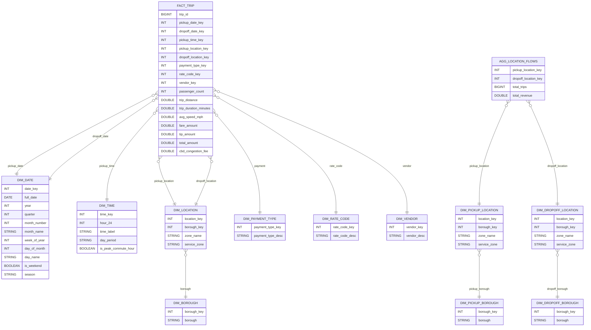

# nycyellowtaxitrip

# City Mobility Analytics

End-to-end **data analytics project** analyzing **New York City taxi trips** to explore urban mobility patterns and build demand forecasting models.

This project demonstrates a complete analytics pipeline including:

- data ingestion
- analytical data warehousing
- dimensional modeling
- exploratory SQL analysis
- business intelligence dashboards
- predictive analytics

---

# Project Overview

The goal of this project is to analyze taxi trip data to better understand **mobility demand in New York City** and identify temporal and spatial patterns in ride activity.

The project includes:

- ingestion of raw trip data
- analytical data warehouse built with DuckDB
- dimensional **star schema** for analytics
- exploratory and analytical SQL queries
- business intelligence dashboards
- demand forecasting

---

# Dataset

The project uses the **NYC Taxi Trip Record dataset** published by the **New York City Taxi & Limousine Commission (TLC)**.

The dataset contains detailed information about each taxi trip, including:

- pickup and dropoff timestamps
- pickup and dropoff locations
- trip distance
- passenger count
- payment type
- fare and tip amounts

For this project, the **Yellow Taxi dataset for 2025** is used.

Raw data is stored as **Parquet files**.

The project also uses the official **TLC Taxi Zone Lookup dataset** to enrich the geographical dimension with:

- borough
- zone
- service zone

The dataset also includes the **CBD congestion fee**, introduced as part of New York City's congestion pricing policy.

---

## Data Model

The analytical warehouse follows a **star schema** optimized for analytics.
The model includes a core trip-level star schema (`fact_trip`) for descriptive, diagnostic and operational analytics, as well as a dedicated aggregated flow table (`agg_location_flows`) for mobility origin-destination analysis in Power BI.

## Power BI Dashboard

The Power BI dashboard is structured following the four phases of Business Intelligence:

1. Descriptive analytics — mobility overview
2. Diagnostic analytics — demand drivers
3. Predictive analytics — demand trends
4. Prescriptive analytics — operational insights
5. Geographical analytics

## Project Architecture

Raw Parquet Files
↓
Python Ingestion
↓
DuckDB Analytical Warehouse
↓
SQL Exploration
↓
Data Cleaning & Staging (2025 only)
↓
Dimensional Modeling (Star Schema)
↓
Analytical SQL Queries
↓
Power BI Dashboard
↓
Demand Forecasting

This architecture mirrors a **modern analytics stack used in real data platforms**.

---

# Repository Structure

nycyellowtaxitrip

data/
raw/ # original parquet files
lookup/ # TLC taxi zone lookup table

duckdb/
nyc_taxi.duckdb # analytical database

sql/
exploration.sql # exploratory data analysis
staging.sql # data cleaning and staging layer
quality.sql # data quality checks
quality_star_schema.sql # star schema validation
validation.sql # complete validation raw data to star schema

scripts/
ingestion/ # Python ingestion scripts

dashboards/
powerbi/ # Power BI dashboard

README.md

---

# Technologies Used

- Python
- DuckDB
- SQL
- Parquet
- Power BI
- Git / GitHub

---

# Current Progress

Current stage:

- raw dataset collected
- DuckDB warehouse created
- data imported from parquet files
- exploratory SQL analysis implemented
- data cleaning and staging layer created
- dimensional star schema implemented
- analytical SQL queries developed
- build Power BI dashboard

---

# Next Steps

- implement demand forecasting model